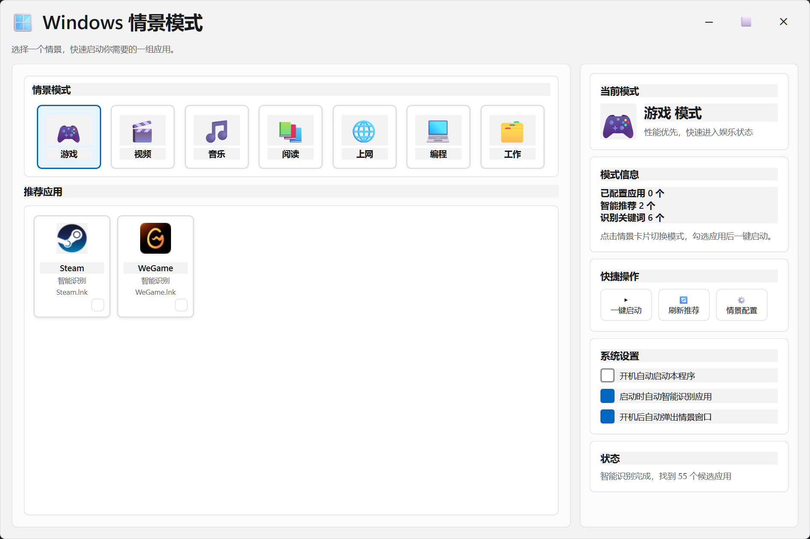

# Windows 情景模式

一个面向 Windows 的桌面情景模式软件。  
开机后弹出情景选择，根据用户本次要做的事情快速组织推荐应用，并一键进入对应使用状态。

当前版本基于 `PySide6` 构建，界面风格偏向 Windows 11。

## 仓库信息

- GitHub: `https://github.com/sakura-love/Windowscene`
- License: `MIT`
- 平台: `Windows`
- 语言: `Python 3`

## 功能特点

- 开机自启动
- 开机后弹出“本次开机做什么”情景窗口
- 支持情景模式选择：游戏、视频、音乐、阅读、上网、编程、工作
- 根据情景推荐对应应用
- 支持手动配置每个情景的应用列表
- 支持简单智能识别常用应用
- 支持一键启动当前情景下的选中应用

## 技术栈

- Python 3
- PySide6

## 界面预览

### 主界面



后续还可以继续补充：

- 开机情景选择弹窗截图
- 推荐应用选择截图

## 项目结构

```text
app.py
qt_app.py
scene_config.json
requirements.txt
app_icon.ico
LICENSE
RELEASE_TEMPLATE.md
```

## 安装依赖

```powershell
cd E:\AIwork\Windowscene-GitHub
pip install -r requirements.txt
```

## 本地运行

```powershell
cd E:\AIwork\Windowscene-GitHub
python app.py
```

## 打包为 EXE

```powershell
python -m PyInstaller --noconfirm --clean --onefile --windowed --name Windowscene --icon app_icon.ico app.py
```

## 发布建议

- 发布文案可参考 `RELEASE_TEMPLATE.md`
- 可在 GitHub Releases 中上传 `Windowscene.exe`
- 建议在仓库首页补上界面截图与版本说明

## 配置说明

`scene_config.json` 中保存了：

- 开机自启动开关
- 开机后是否弹出情景窗口
- 智能识别开关
- 每个情景的关键词
- 每个情景已手动配置的应用

## 当前界面设计

- 左半区上半部分：情景模式
- 左半区下半部分：推荐应用
- 右半区：当前模式信息、快捷操作、系统设置、状态
- 推荐应用按左到右、从上到下排列

## 后续可以继续增强

- 提高 `.lnk` 和 `.exe` 图标提取成功率
- 接入更完整的 Windows 已安装软件识别
- 增加系统动作，例如音量、电源模式、勿扰模式
- 支持托盘常驻
- 增加最近情景和智能推荐
