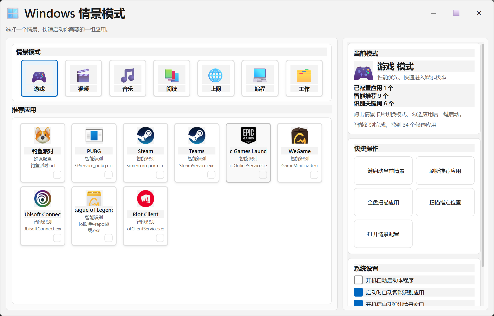

# Windows 情景模式

<p align="center">
  
</p>

<p align="center">
  <strong>把 Windows 开机后的第一步，变成一次有方向的选择。</strong>
</p>

<p align="center">
  一个偏 Windows 11 风格的桌面情景模式工具。<br>
  开机后先选择你这次要做什么，再从推荐应用里勾选真正要启动的软件，而不是被一堆固定自启动打断节奏。
</p>

<p align="center">
  
  
  
  
</p>

## 这个项目解决什么问题

很多 Windows 用户的开机体验都很混乱：

- 软件一股脑自启动，但这次其实根本用不上
- 想进入“工作 / 游戏 / 编程 / 阅读”状态时，还得自己手动找一遍应用
- 常用软件越来越多，但每次真正要开的只有其中一小部分

`Windows 情景模式` 的思路是：
先问你“这次开机要做什么”，再围绕这个情景给出一组更贴近当下任务的应用选项，由你自己勾选本次真正要启动的内容。

## 核心亮点

- 开机后弹出情景选择，不再被固定自启动绑架
- 情景模式和推荐应用都用卡片式图形界面呈现
- 预设应用只是候选项，不会默认全部自动启动
- 支持全盘扫描和指定目录扫描，逐步补全应用库
- 首次扫描后会本地缓存，后续打开更快
- 支持 `.url`、`.exe`、`.lnk` 等常见入口的图标兜底识别
- 当前发布版支持单文件 `exe` 分发，下载后可直接运行

## 当前支持的情景

- 游戏
- 视频
- 音乐
- 阅读
- 上网
- 编程
- 工作

## 界面预览

### 主界面


## 为什么值得 Fork

这个项目很适合作为二次开发起点，因为它已经把几个麻烦但基础的部分先搭起来了：

- Windows 桌面 GUI 基础框架
- 情景模式与推荐应用的主流程
- 应用扫描、去重、缓存和分类规则
- 开机启动逻辑
- 单文件 EXE 打包链路

如果你想继续做成更完整的桌面效率工具，可以直接在这个基础上扩展：

- 托盘常驻
- 更完整的已安装应用识别
- 音量、电源模式、勿扰模式等系统动作
- 最近使用情景 / 智能推荐
- 游戏模式、创作模式、学习模式等更细分场景

## 下载与使用

如果你只是想使用软件，直接下载 Release 里的 `Windowscene.exe` 即可。

当前版本已经支持单文件分发：

- 用户只需要下载一个 `exe`
- 默认配置会在首次运行时自动初始化
- 后续情景配置会由程序自动保存

## 快速开始

### 本地运行

```powershell
cd E:\AIwork\Windowscene-GitHub
pip install -r requirements.txt
python app.py
```

### 打包为 EXE

```powershell
python -m PyInstaller --noconfirm --clean --onefile --windowed --name Windowscene --icon app_icon.ico app.py
```

## 项目结构

```text
app.py
qt_app.py
known_apps.json
requirements.txt
app_icon.ico
screenshots/
```

## 配置与数据

程序运行时会维护这些数据：

- `scene_config.json`：用户自己的情景配置
- `known_apps.json`：常见应用与游戏分类规则
- `app_scan_cache.json`：扫描后的本地缓存

打包后的正式版会自动处理这些文件，普通用户不需要手动准备。

## v1.2.1 更新

- 调整配置与规则文件读取逻辑，支持程序首次运行时自动生成默认配置
- 优化打包后的资源加载方式，支持单 `exe` 分发
- 修正任务栏图标与窗口图标初始化逻辑
- 重整右侧信息栏与快捷操作区布局，减少默认窗口大小下的堆叠问题
- 补强 `.url` 快捷方式与部分 `.exe` 的图标获取逻辑
- 扩充常见应用与游戏分类规则库

## 路线图

- 提升 `.lnk`、`.url`、`.exe` 图标提取成功率
- 增加更完整的 Windows 已安装应用识别
- 增加托盘常驻
- 增加更多系统级情景动作

## License

MIT
